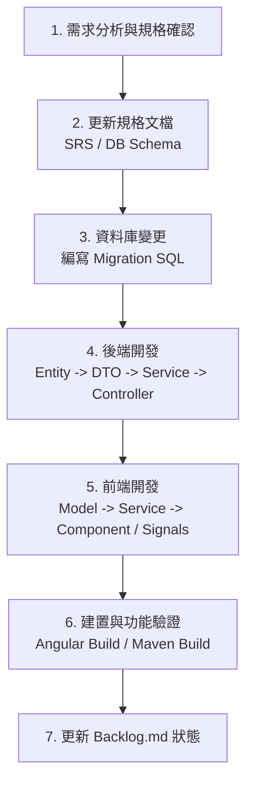

# AGENTS.md — D&D 冒險日誌專案 Agent 指引

歡迎來到 **D&D 冒險日誌系統 (dnd-adventure-log)** 專案！本檔案為 AI Agent 提供本專案的高階指引與工作原則。

---

## 🧭 專案核心文件索引

在進行任何工作之前，請先參閱以下核心文檔：

| 檔案 | 說明 |
|---|---|
| [`backlog.md`](file:///d:/dnd%20adv%20log/backlog.md) | **工作任務清單**（任務狀態、歷史紀錄、待辦項目） |
| [`system-requirements-spec.md`](file:///d:/dnd%20adv%20log/system-requirements-spec.md) | **系統需求規格書 (SRS)**（欄位定義、業務規則、UI/UX 行為） |
| [`database-schema.md`](file:///d:/dnd%20adv%20log/database-schema.md) | **資料庫綱要與 Migration SQL**（Supabase PostgreSQL 表結構與歷次 ALTER 語句） |
| [`user-stories.md`](file:///d:/dnd%20adv%20log/user-stories.md) | **使用者故事與驗收條件** |
| [`.agents/rules/project-conventions.md`](file:///d:/dnd%20adv%20log/.agents/rules/project-conventions.md) | **專案開發規範與架構標準**（代碼風格、分層職責、Signals 規範） |

---

## 🛠️ 開發與建置指令

### 前端 (Angular 22)
```bash
# 工作目錄: frontend/
cd frontend
npm install       # 安裝依賴
npm start         # 啟動開發伺服器 (http://localhost:4200)
npm run build     # Production 建置驗證
```

### 後端 (Spring Boot 4 / Java 17)
```bash
# 工作目錄: backend/
cd backend
./mvnw spring-boot:run              # 本機啟動 (http://localhost:8080)
./mvnw clean package -DskipTests    # 打包驗證 (產生 target/*.jar)
```

---

## 🔄 端到端功能開發標準流程 (Feature SOP)

當要新增或調整一個業務功能時，請遵循以下步驟：



1. **規格先行**：更新 `system-requirements-spec.md` 與 `database-schema.md`。
2. **資料庫層**：提供冪等性的 Migration SQL（`IF NOT EXISTS` / `ADD COLUMN IF NOT EXISTS`）。
3. **後端層**：
   - Entity 與 JPA Mapping。
   - Request / Response DTO（禁止 Controller 暴露 Entity）。
   - Service 商業邏輯運算與交易處理（`@Transactional`）。
   - Controller 路由與參數校驗。
4. **前端層**：
   - TypeScript Model 定義更新。
   - Service API 串接。
   - Standalone Component 視圖與 Signals (`signal()`, `computed()`) 即時響應。
5. **交付與回報**：
   - 驗證編譯無誤。
   - 更新 `backlog.md` 標註完成與備註。
